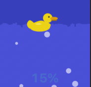

# BubbleDuck

A macOS Dock tile system monitor inspired by [wmbubble](https://github.com/rnjacobs/wmbubble), the classic WindowMaker dockapp.

Your Dock icon becomes a living aquarium that visualizes system health at a glance:

- **Water level** rises and falls with **memory usage**
- **Bubbles** float up proportional to **CPU load**
- **Water color** shifts from blue to red as **swap usage** increases
- A **rubber duck** bobs on the surface

## Screenshot

<p align="center">
  
</p>

## Requirements

- macOS 14 (Sonoma) or later
- Xcode 15+ (full installation, not just CommandLineTools)

## Build & Run

```bash
# Select Xcode toolchain (if not already set)
sudo xcode-select -s /Applications/Xcode.app/Contents/Developer

# Build
swift build

# Run
swift run BubbleDuck

# Run tests (cross-platform simulation tests)
swift test
```

## Architecture

The project is split into two layers:

| Module | Path | Platform | Purpose |
|---|---|---|---|
| **BubbleCore** | `Sources/BubbleCore/` | Any (Swift) | Water simulation, bubble physics, color theme, duck state |
| **BubbleDuck** | `Sources/BubbleDuck/` | macOS only | AppKit dock tile, system metrics, Core Graphics rendering |

This separation means the simulation logic can be edited and tested from any environment (including Linux), while the macOS UI layer requires a Mac to build.

### How it works

1. **SystemMetrics** polls CPU, memory, and swap via Mach kernel APIs (`host_statistics`, `vm_statistics64`, `sysctl`)
2. **SimulationState** feeds those metrics into the water and bubble physics each frame
3. **BubbleRenderer** draws the tank, bubbles, and duck to an `NSImage` using Core Graphics
4. **DockTileController** pushes the rendered image to `NSApplication.shared.dockTile` at ~60fps

### Physics (ported from wmbubble)

- Water columns use a **spring model** with configurable volatility, viscosity, and speed limit
- Bubbles spawn with probability equal to the CPU load percentage
- Popping bubbles and new bubbles **displace the water surface**, creating ripple waves
- The duck drifts horizontally and follows the water level, flipping upside-down when memory is nearly full

## Configuration

Right-click the dock icon → **Settings**, or press **Cmd+,** to open the settings panel.

- **Physics**: max bubbles, gravity, ripple strength, volatility, viscosity, speed limit
- **Features**: duck on/off
- **Overlays**: click the dock icon to cycle through load average and memory info screens

## Origin

This project is a conversion of **wmbubble** (originally "bubblemon-dockapp") by Johan Walles, Merlin Hughes, and timecop, maintained by Robert Jacobs. The original monitors system resources as an animated dockapp for WindowMaker and similar X11 window managers. BubbleDuck brings the same concept to the macOS Dock.

## License

GPL-2.0-or-later — same license as wmbubble.

See [LICENSE](LICENSE) for details.
